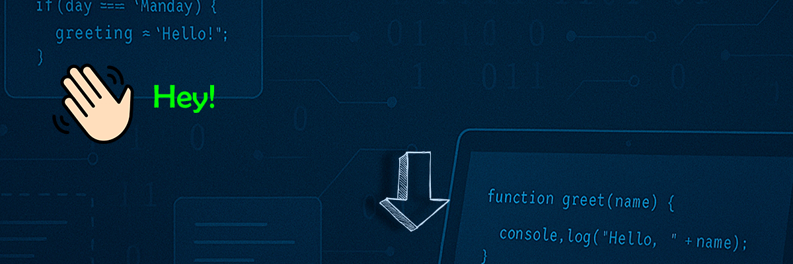

## Hola! soy Jairo 👋

Fuerte!

<!--
**jairoCarrasco97/jairoCarrasco97** is a ✨ _special_ ✨ repository because its `README.md` (this file) appears on your GitHub profile.

Programador Junior con conocimientos básicos en ingeniería, me encanta la resolución de problemas, buscar soluciones eficientes y ¡disfrutar del proceso!

Comencé estudiando Ingeniería Eléctrica en 2016, ya que una de mis pasiones son las matemáticas, la física y la resolución de problemas. Tras años de estudio,
en 2022, y varias asignaturas que involucraban programación me quedé fascinado por el mundo de la programación. ¡Podías imaginar lo que quisieras y programarlo!
Así encontré mi vocación, la programación.
